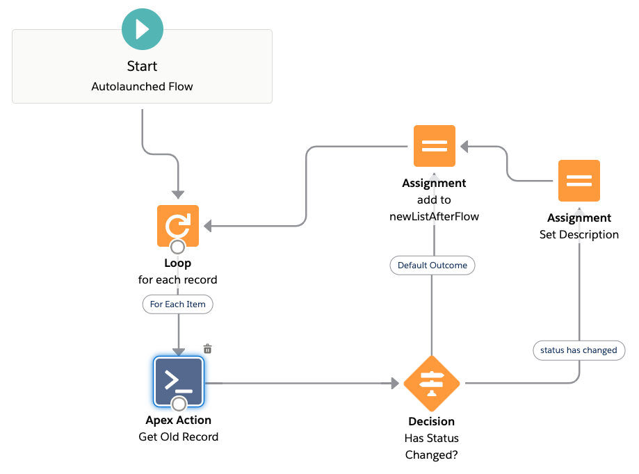
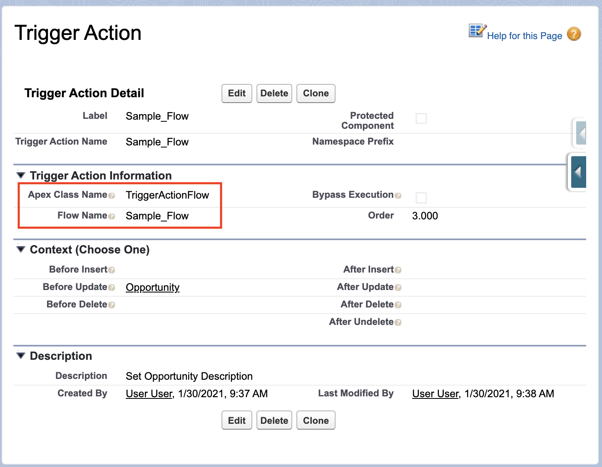
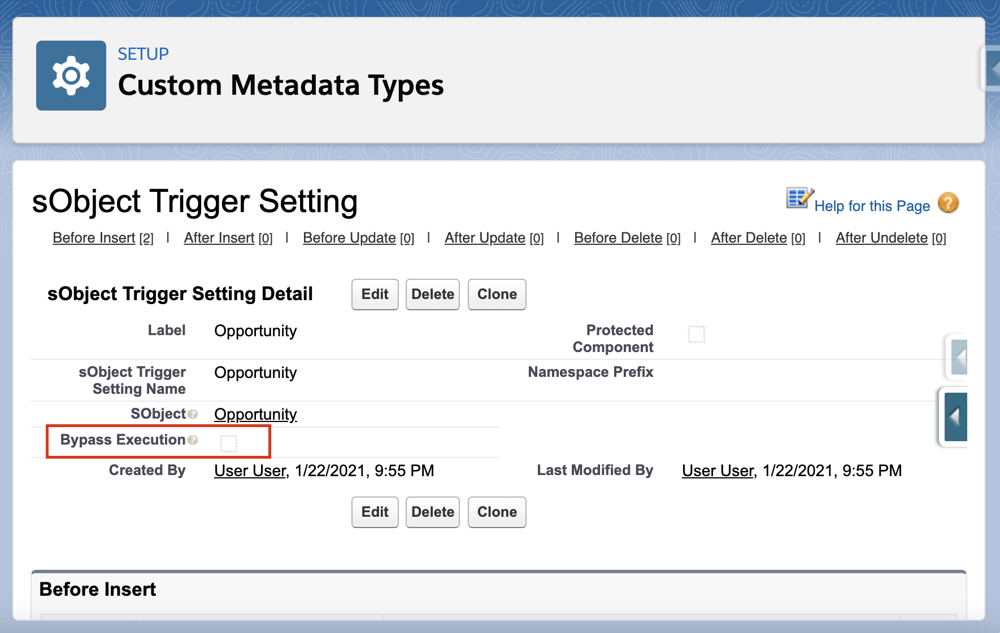
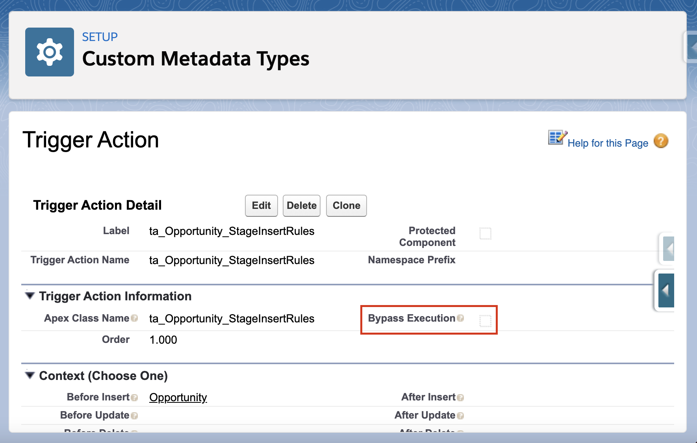
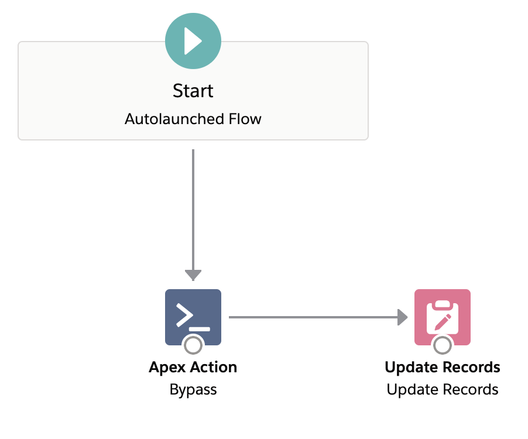
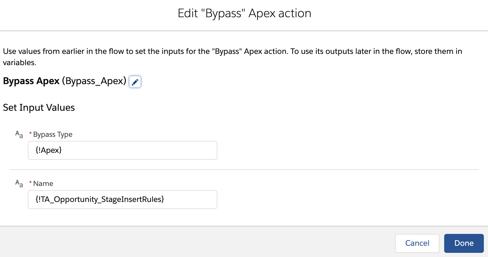
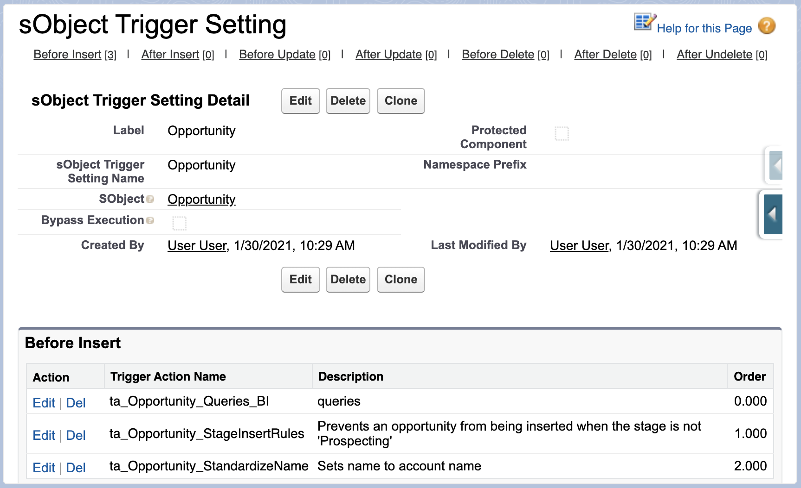

# ApexTriggerFramework
Salesforce Trigger Framework

This project is meant to demonstrate an Apex Trigger Framework which is built with the following goals in mind:

1. Single Trigger per sObject
2. Logic-less Triggers
3. Context Specific Implementation
4. Easy to Migrate Existing Code
5. Simple Unit Testing
6. Configuration from Setup Menu
7. Adherance to SOLID Principles

---

## Metadata Driven Trigger Actions

In order to use this trigger framework, we start with the `MetadataTriggerHandler` class which is included in this project.

To define a specific action, we write an individual class which implements the correct context interface.

This allows us to use custom metadata to configure a few things from the setup menu:

- The sObject and context for which an action is supposed to execute
- The order to take those actions within a given context
- A checkbox to bypass execution at the sObject or trigger action level

The setup menu provides a consolidated view of all of the actions that are executed when a record is inserted, updated, deleted, or undeleted.

The `MetadataTriggerHandler` class fetches all Trigger Action metadata that is configured in the org, and dynamically creates an instance of an object which implements a `TriggerAction` interface and casts it to the appropriate interface as specified in the metadata, then calls their respective context methods in the order specified.

Now, as future development work gets completed, we won't need to keep modifying the bodies of our triggerHandler classes, we can just create a new class for each new piece of functionality that we want and configure those to run in a specified order within a given context.

Note that if an Apex class is specified in metadata and it does not exist or does not implement the correct interface, a runtime error will occur.

---

## Support for Flows

The trigger action framework can also allow you to invoke a flow by name, and determine the order of the flow's execution amongst other trigger actions in a given trigger context.

To make your flows usable, they must be auto-launched flows and you need to create the following flow resource variables depending on which context the flow is meant to be called in:

| Variable Name    | Variable Type     | Available for Input | Available for Output | Description                                                     |
| ---------------- | ----------------- | ------------------- | -------------------- | --------------------------------------------------------------- |
| newList          | Record Collection | yes                 | no                   | Used to store the Trigger.new records                           |
| oldList          | Record Collection | yes                 | no                   | Used to store the Trigger.old records                           |
| newListAfterFlow | Record Collection | no                  | yes                  | Used to apply record values back during before insert or update |

You can use the `TriggerActionFlow.getOldRecord` invocable method to get the old version of a record and see which values have changed. In order to modify field values before insert or update, we must assign all records back to the `newListAfterFlow` collection variable.

Here is an example of an auto-launched flow that checks if a Case's status has changed and if so it sets the Case's description to a default value.

To enable this flow, simply insert a trigger action record with Apex Class Name equal to "TriggerActionFlow" and set the Flow Name field with the API name of the flow itself. You can select the "Allow Flow Recursion" checkbox to allow flows to run recursively (advanced).

---

## Compatibility with sObjects from Installed Packages

The Trigger Actions Framework supports standard objects, custom objects, and objects from installed packages. To use the framework with an object from an installed package, separate the Object API Name from the Object Namespace on the sObject Trigger Setting itself. For example, if you want to use the Trigger Actions Framework on an sObject called `Acme__Explosives__c`, configure the sObject Trigger Setting like this:

| Object Namespace | Object API Name |
| ---------------- | --------------- |
| Acme             | Explosives\_\_c |

---

## Recursion Prevention

Use the `TriggerBase.idToNumberOfTimesSeenBeforeUpdate` and `TriggerBase.idToNumberOfTimesSeenAfterUpdate` to prevent recursively processing the same record(s).

---

## Bypass Mechanisms

You can also bypass execution on either an entire sObject, or for a specific action.

### Bypass from Setup Menu

To bypass from the setup menu, simply navigate to the sObject Trigger Setting or Trigger Action metadata record you are interested in and check the Bypass Execution checkbox.

These bypasses will stay active until the checkbox is unchecked.

### Static Bypasses

You can bypass all actions on an sObject as well as specific Apex or Flow actions for the remainder of the transaction using Apex or Flow.

#### Bypass from Apex

To bypass from Apex, use the static `bypass(String name)` method in the `TriggerBase`, `MetadataTriggerHandler`, or `TriggerActionFlow` classes.

#### Bypass from Flow

To bypass from Flow, use the `TriggerActionFlowBypass.bypass` invocable method. You can set the `bypassType` to `Apex`, `Object`, or `Flow`, then pass the API name of the object, class, or flow you would like to bypass into the `name` field.

#### Clear Apex and Flow Bypasses

The Apex and Flow bypasses will stay active until the transaction is complete or until cleared using the `clearBypass` or `clearAllBypasses` methods in the `TriggerBase`, `MetadataTriggerHandler`, or `TriggerActionFlow` classes. There are also corresponding invocable methods in the `TriggerActionFlowClearBypass` and `TriggerActionFlowClearAllBypasses` which will perform the same resetting of the bypass. To use these invocable methods, set the `bypassType` to `Apex`, `Object`, or `Flow`, then to clear a specific bypass set the API name of the object, class, or flow you would like to clear the bypass for into the `name` field.

### Bypass Execution with Permissions

Both the `sObject_Trigger_Setting__mdt` and the `Trigger_Action__mdt` have fields called `Bypass_Permission__c` and `Required_Permission__c`. Both of these fields are optional, but they can control execution flow.

#### Bypass Permission

Developers can enter the API name of a permission in the `Bypass_Permission__c` field. If this field has a value, then the trigger/action will be bypassed if the running user has the custom permission identified. This can be helpful when assigned to an integration service-account user to facilitate large data loads, or when assigned to a system administrator for a one-time data load activity.

#### Required Permission

Developers can enter the API name of a permission in the `Required_Permission__c` field. If this field has a value, then the trigger/action will only exectute if the running user has the custom permission identified. This can be allow for new functionality to be released to a subset of users.

---

## Avoid Repeated Queries

It could be the case that multiple triggered actions on the same sObject require results from a query to implement their logic. In order to avoid making duplicative queries to fetch similar data, use the singleton pattern to fetch and store query results once then use them in multiple individual action classes.

Now configure the queries to be the first action to be executed within the given context, and the results will be available for any subsequent triggered action.

---

## Use of Trigger Maps

To avoid having to downcast from `Map<Id,sObject>`, we simply construct a new map out of our `newList` and `oldList` variables:

This will help the transition process if you are migrating an existing Salesforce application to this new trigger actions framework.

---
